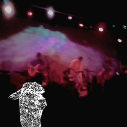

# Home

## Llama Music

    A new app coming soon to all your Windows 10 devices...

[][link-store-lma]

**Llama Music** is an unofficial Live Music Archive client and spiritual
successor to the highly-rated **Live Music Access** app enjoyed on Windows
Phone.

**Browse**, **search**, and **stream** concert recordings from Internet Archive's [Live
Music Archive][link-etree] (_etree_ collection) to **all** your Windows 10 devices.

### Feature Highlights

- **Free**.

- **Legal**.

- **No** advertisements.

- **No** in-app purchases.

- Background audio support.

- **Gapless** playback. (_Finally!_)

- Automatic **Bookmarks** so you can easily resume a previous concert.

- Multiple ways to **Tag** recordings.

- Bookmarks and tags **sync** between your devices.

- **Pin** concerts, artists, venues, taper, and more to your Start screen.

- View all bookmarks, tags, and pinned recording in **History** view.

- Theme settings
  - **System** _"It's a buck dancer's choice my friend"_ Theme
  - **Dark** _"The sunny side of the street is dark"_ Theme
  - **Light** _"Like an angel, standing in a shaft of light"_ Theme
  - **Opposite System** _"Every silver lining's got a touch of grey"_ Theme
  - **Clock-based**  _"One watch by night, one watch by day"_ Theme
  - **Random** _"Ain't no luck, I learned to duck"_ Theme

- Roll the dice to discover new music with **Random** buttons.

- **Search** multiple attributes to find exactly the show you want.

- **Share** concerts with your friends.

- Display album art of current and recent plays on your **Lock screen**.

- Cortana **voice command** integration.

- Desktop, laptop, and tablet support
  - Interface adapts to input method.
  - Tooltips.
  - **Keyboard** commands.
    - **`ESC`** back or close.
    - **`CTRL`+`F`** find.
    - **`CTRL`+`H`** share.
    - **`CTRL`+`I`** pin.
    - **`CTRL`+`D`** bands.
    - **`CTRL`+`O`** random.
    - **`CTRL`+`P`** play/pause.
    - **`CTRL`+`J`** eject.
    - **`CTRL`+`,`** settings.
    - **`F1`** about.
    - ...and _more!_

- **Phone** support, too!
  - This app is _just exactly perfect_ for a phone form factor.
  - Recreated some old native UX removed by _Windows 10 Mobile_.
  - No "trigram for heaven" button in an awkward upper corner.
  - Tapping either end of the command bar _opens the secondary menu_; not just the ellipsis.
  - Better thumb-ability with commands on _bottom_ of screen.
  - Primary navigation via pivots and lists.
  - Seems _faster_.

- **HoloLens** support
  - _What?!?!_ (I guess it works, but I still gotta see it to believe it.)

- ...and a lot of **attention to detail**: natural sorting of band names,
  transition arrow standardization, track title data cleansing, metadata
  sanitizations, etc.

### Coming Soon

- Support for **Xbox One** (and it is looking _fantastic_).
- Compact Overlay support (basically, **picture-in-picture** on your PC).
- More **Cortana** commands to find what you want to play.
- Other stuff _we_ want.
- Other stuff _you_ want.
- ...and more?

### Internet Archive

Music and metadata is provided by the Internet Archive's [_Live Music
Archive_][link-etree] and its contributors.

> **What is the Live Music Archive all about?**
>
> This audio archive is an online public library of live recordings available
> for royalty-free, no-cost public downloads. We only host material by
> trade-friendly artists: those who like the idea of noncommercial distribution
> of some or all of their live material. Live recordings are a part of our
> culture and might be lost in 100 years if they're not archived. We think music
> matters and want to preserve it for future generations.
>
> —Internet Archive FAQ

----

## Live Music Access

[][link-store-lma-legacy]

If you are still running Windows Phone 8, [get this app][link-store-lma-legacy].

### Reviews

> Great app for listening to a lot of good live music recordings from a wide range of bands.

> The best live music app, I have come across.

> Best app ever works like nobody's business waited for a long time for this

### Version Highlights

- v2.0.80.15
  - New track change icons.
  - Images in concert details.
  - If you enjoy this app, please rate it 5 stars! (It won't nag you to do that.)

- v2.0.80.14
  - Answer to "Why a llama?"

- v2.0.80.12
  - UI tweaks.
  - Tip jar for the llama (on the about page).

- v2.0.80.11
  - More UI love.
  - Some cache logic changes.

- v2.0.80.10
  - Mostly a little more UI love.

- v2.0.80.9
  - A few new icons.
  - Additional data cache.

- v2.0.80.8
  - UI enhancements (in celebration of this app's 2nd anniversary).

- v2.0.80.7
  - Infinitely joinable shows.

- v2.0.80.6
  - Additional share options.
  - Shorter links for sharing (and joining!) shows.
  - Fast app resume.
  - Automatic scroll to paused, resumed, or joined track.

- v2.0.80.5
  - Tile transparency.
  - Share text reformatted.

- v2.0.80.4
  - Easier to recall the most recently played concert.
  - Upcoming event information now powered by JamBase V3 API.

- v2.0.80.3
  - Now playing live tile.

- v2.0.80.2
  - Minor performance improvements.

- v2.0.80.1
  - Browse and search by artist via band list.
  - Pin artists to Start screen.
  - Browse by related concert attributes (artist, date, venue, location, taper, transferer).
  - Enhanced search capabilities.
  - Random concert suggestions now favor soundboard and matrix recordings.
  - Lock screen display of currently playing concert and history.
  - Resume concerts from previously played position.
  - Share concerts via Messaging, Email, or Social Networks.
  - Join shared concerts at a relative time or paused position.
  - Add upcoming event information (powered by JamBase) to calendar.
  - and much more...

----

## Contact

[link-etree]: https://archive.org/details/etree/
[link-store-lma]: https://www.microsoft.com/store/apps/9WZDNCRDCNJT
[link-store-lma-legacy]: https://www.microsoft.com/store/apps/9WZDNCRDCNJX
